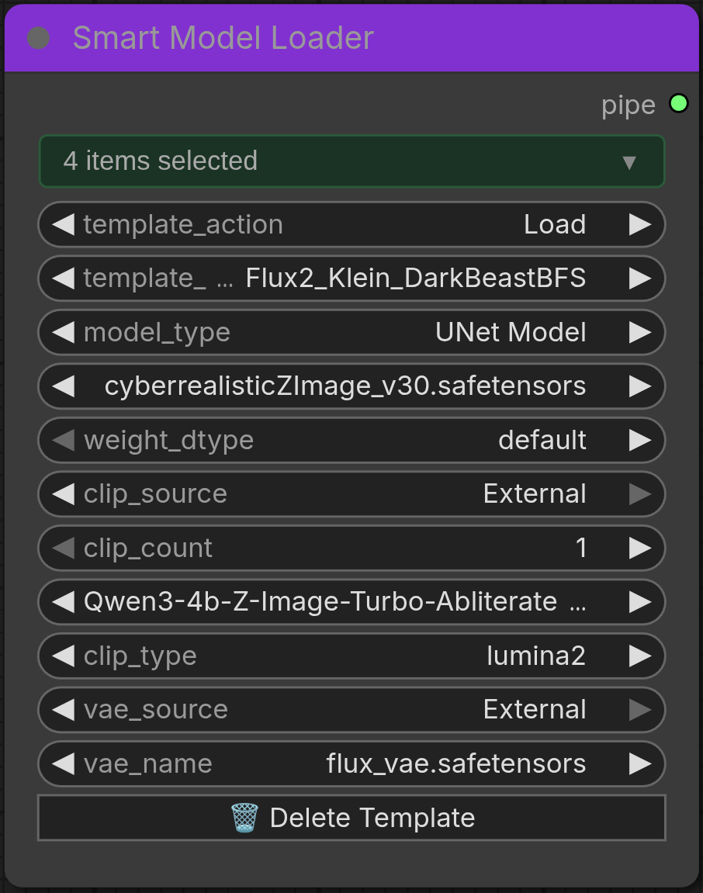
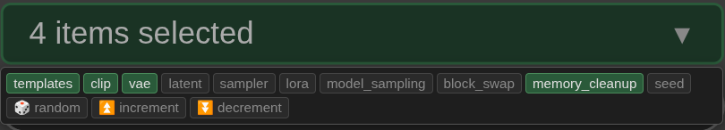

# Smart Model Loader User Guide

The unified model loader for ComfyUI_Eclipse — replaces the older Smart Loader Plus, Smart Loader, and Smart Loader Basic variants.

## Table of Contents

<table cellspacing="0" cellpadding="0" style="border: none; border-collapse: collapse;">
<tr><td valign="top" style="border: none;">
<br>

</td>

<td valign="top" style="border: none;">

- [Overview](#overview)
- [Combo-Chip Feature System](#combo-chip-feature-system)
- [Model Types & Formats](#model-types--formats)
- [Template System](#template-system)
- [CLIP Configuration](#clip-configuration)
- [VAE Configuration](#vae-configuration)
- [Latent Configuration](#latent-configuration)
- [Sampler Settings](#sampler-settings)
- [LoRA Configuration](#lora-configuration)
- [Model Sampling](#model-sampling)
- [Block Swap](#block-swap)
- [Quantization Settings](#quantization-settings)
- [Seed Control](#seed-control)
- [Output](#output)
- [Step-by-Step Usage](#step-by-step-usage)
- [Tips & Best Practices](#tips--best-practices)
- [Troubleshooting](#troubleshooting)
 
</td></tr></table>

---

## Overview

**Node Name:** `Smart Model Loader [Eclipse]`

The Smart Model Loader is a single, feature-rich loader that handles model loading, CLIP configuration, VAE setup, latent creation, sampler settings, LoRA stacking, model sampling, and block swap — all controlled by combo-chip feature toggles. Enable only the sections you need; disabled sections are hidden from the UI.

### Key Features

- **Multi-Format Support:** Standard Checkpoints, UNet, Nunchaku Flux/Qwen/ZImage (SVDQuant), GGUF
- **Combo-Chip Toggles:** 13 feature chips control which sections are visible and active
- **Template System:** Save and load complete configurations instantly
- **CLIP Ensemble:** Up to 4 CLIP modules with 27 architecture types
- **LoRA Support:** Up to 3 LoRA slots with per-slot weight and on/off switches
- **Model Sampling:** 8 sampling methods for different architectures
- **Block Swap:** GPU↔CPU block offloading for large models
- **Single PIPE Output:** All loaded components in one connection

---

## Combo-Chip Feature System

The node uses a combo-chip widget at the top to control which configuration sections appear. Click chips to toggle them on/off.

### Available Chips

| Chip | Default | What It Controls |
|------|---------|-----------------|
| `templates` | off | Template save/load/delete system |
| `clip` | **on** | CLIP source, type, ensemble, layer trimming |
| `vae` | **on** | VAE source selection |
| `latent` | off | Resolution presets, custom dimensions, batch size |
| `sampler` | off | Sampler, scheduler, steps, CFG, flux_guidance |
| `lora` | off | Up to 3 LoRA slots |
| `model_sampling` | off | Sampling method and architecture-specific parameters |
| `block_swap` | off | GPU↔CPU block offloading |
| `memory_cleanup` | **on** | Automatic VRAM purge before loading |
| `seed` | off | Seed control with mode chips below |
| `🎲 random` | off | Seed mode: randomize each execution |
| `⏫ increment` | off | Seed mode: increment after each execution |
| `⏬ decrement` | off | Seed mode: decrement after each execution |

**Default enabled:** `clip`, `vae`, `memory_cleanup`

The seed mode chips (`🎲 random`, `⏫ increment`, `⏬ decrement`) are mutually exclusive — selecting one deselects the others. They only appear when the `seed` chip is enabled.

---

## Model Types & Formats

Select `model_type` to choose which format to load:

### Standard Checkpoint
- Traditional all-in-one `.safetensors` or `.ckpt` file containing MODEL + CLIP + VAE
- **Location:** `ComfyUI/models/checkpoints/`
- CLIP source can be "Baked" (from checkpoint) or "External"
- VAE source can be "Baked" or "External"

### UNet Model
- Standalone diffusion model without CLIP/VAE
- **Location:** `ComfyUI/models/diffusion_models/`
- Requires External CLIP and VAE
- `weight_dtype` options: default, fp8_e4m3fn, fp8_e4m3fn_fast, fp8_e5m2

### Nunchaku Flux (Quantized)
- Compressed Flux models using SVDQuant (INT4/FP4/FP8)
- **Location:** `ComfyUI/models/diffusion_models/`
- Requires [ComfyUI-Nunchaku](https://github.com/nunchaku-tech/ComfyUI-nunchaku) extension
- Settings: data_type, cache_threshold, attention, i2f_mode, cpu_offload

### Nunchaku Qwen (Quantized)
- Compressed Qwen image understanding models
- **Location:** `ComfyUI/models/diffusion_models/`
- Requires ComfyUI-Nunchaku extension
- Settings: num_blocks_on_gpu, use_pin_memory, cpu_offload

### Nunchaku ZImage (Quantized)
- ZImage quantized models
- **Location:** `ComfyUI/models/diffusion_models/`
- Same settings as Nunchaku Qwen

### GGUF Model (Quantized)
- GGUF format quantized diffusion models
- **Location:** `ComfyUI/models/diffusion_models/`
- Requires [ComfyUI-GGUF](https://github.com/city96/ComfyUI-GGUF) extension
- Settings: gguf_dequant_dtype, gguf_patch_dtype, gguf_patch_on_device

**Note:** Without Nunchaku or GGUF extensions installed, the loader still works — quantized model type options are simply disabled.

---

## Template System

Enable the **templates** chip to access the template system.

### How Templates Work

Templates save your complete loader configuration to a JSON file in `ComfyUI_Eclipse/templates/` (also accessible via `models/Eclipse/templates/` junction).

**Saving:** Set `template_action` to "Save", enter a name in `new_template_name`, and execute. The template captures all current settings.

**Loading:** Set `template_action` to "Load" and select from the `template_name` dropdown. All settings reset to defaults first, then template values are applied — ensuring a clean state.

**Deleting:** With `template_action` set to "Load", select the template and click the "Delete Template" button.

### What Gets Saved

Templates only save settings for enabled feature chips:
- Model type and model file selection (always)
- CLIP settings (if `clip` chip enabled)
- VAE settings (if `vae` chip enabled)
- Latent/resolution (if `latent` chip enabled)
- Sampler settings (if `sampler` chip enabled)
- LoRA slots (if `lora` chip enabled, all 3 slots saved even if off)
- Model sampling method (if `model_sampling` chip enabled)

### Cross-Session Workflow

1. Configure the loader completely and test
2. Enable **templates** chip → Save
3. Next session: enable **templates** chip → Load
4. All settings restored instantly

---

## CLIP Configuration

Requires the **clip** chip to be enabled (on by default).

### CLIP Source

- **Baked:** Use CLIP embedded in the checkpoint (Standard Checkpoint only)
- **External:** Load separate CLIP files from `ComfyUI/models/clip/` or `ComfyUI/models/text_encoders/`

### CLIP Ensemble

Set `clip_count` from 1 to 4. Each slot gets its own file selector (`clip_name1` through `clip_name4`).

**Supported formats:** `.safetensors` and `.gguf` (GGUF requires ComfyUI-GGUF extension)

### CLIP Types (27 supported)

| Type | Use For |
|------|---------|
| `flux` | Flux models (typically 2 modules) |
| `flux2` | Flux 2 models |
| `sd3` | Stable Diffusion 3 |
| `sdxl` | SDXL models |
| `stable_cascade` | Stable Cascade |
| `stable_audio` | Audio models |
| `hunyuan_dit` | Hunyuan DiT |
| `mochi` | Mochi video |
| `ltxv` | LTXV video |
| `hunyuan_video` | Hunyuan Video |
| `pixart` | PixArt |
| `cosmos` | Cosmos |
| `lumina2` | Lumina 2 |
| `wan` | WAN video |
| `hidream` | HiDream |
| `chroma` | Chroma |
| `ace` | ACE |
| `omnigen2` | OmniGen2 |
| `qwen_image` | Qwen image understanding |
| `hunyuan_image` | Hunyuan Image |
| `hunyuan_video_15` | Hunyuan Video 1.5 |
| `ovis` | Ovis |
| `kandinsky5` | Kandinsky 5 |
| `kandinsky5_image` | Kandinsky 5 Image |
| `newbie` | Other/experimental |

### CLIP Layer Trimming

Enable `enable_clip_layer` and set `stop_at_clip_layer` (range -24 to -1):
- `-1`: Full CLIP (all layers)
- `-2`: Skip last layer (recommended default)
- `-3` or lower: Skip more layers, reduces prompt adherence

---

## VAE Configuration

Requires the **vae** chip to be enabled (on by default).

- **Baked:** Use VAE from the checkpoint file (Standard Checkpoint only)
- **External:** Load from `ComfyUI/models/vae/`. Required for UNet and quantized model types.

---

## Latent Configuration

Enable the **latent** chip to configure empty latent creation within the loader.

- **Resolution presets:** Flux, SDXL, HiDream, Qwen, WAN, and more (from `RESOLUTION_PRESETS`)
- **Custom dimensions:** Manual `width` and `height` (16–2000, step 8)
- **Batch size:** 1–4096

When disabled, use a separate Empty Latent Image node.

---

## Sampler Settings

Enable the **sampler** chip to configure sampling within the loader.

| Setting | Range | Default |
|---------|-------|---------|
| `sampler_name` | All ComfyUI samplers | euler |
| `scheduler` | All ComfyUI schedulers | normal |
| `steps` | 1–150 | 20 |
| `cfg` | 1.0–30.0 | 8.0 |
| `flux_guidance` | 0.0–10.0 | 3.5 |
| `batch_size` | 1–4096 | 1 |

When disabled, use a separate KSampler node or Smart Sampler Settings v2.

---

## LoRA Configuration

Enable the **lora** chip to add up to 3 LoRA slots.

Each slot provides:
- `lora_switch_N` — On/Off toggle
- `lora_name_N` — LoRA file from `ComfyUI/models/loras/`
- `lora_weight_N` — Weight (-10.0 to 10.0, default 1.0)

Set `lora_count` to control how many slots are visible (1–3). LoRAs are applied model-only (no separate CLIP weight).

---

## Model Sampling

Enable the **model_sampling** chip to configure architecture-specific sampling methods.

### Sampling Methods

| Method | Use For | Key Parameters |
|--------|---------|----------------|
| None | Standard models | — |
| SD3 | Stable Diffusion 3 | shift |
| AuraFlow | AuraFlow models | shift |
| Flux | Flux Dev/Schnell/variants | shift, base_shift, width, height |
| Stable Cascade | Stable Cascade | shift |
| LCM | Distilled/few-step models | original_timesteps, zsnr |
| ContinuousEDM | EDM-based models | subtype, sigma_max, sigma_min |
| ContinuousV | V-prediction models | sigma_max, sigma_min |
| LTXV | Lightricks video | shift, base_shift |

### Flux Dimension Calculation

Flux calculates shift dynamically from image dimensions:
```
shift = ((width * height / 1024) * slope) + intercept
```
When the **latent** chip is also enabled, dimensions auto-fill from latent configuration.

---

## Block Swap

Enable the **block_swap** chip for GPU↔CPU block offloading. Useful for large models that don't fit entirely in VRAM.

- `blocks_to_swap` — Number of blocks to offload to CPU (0–100, default 10)
- `offload_embeddings` — Also offload embedding layers (default: off)

Higher values save more VRAM but slow down inference.

---

## Quantization Settings

These appear automatically based on the selected `model_type`:

### Nunchaku Flux

| Setting | Options | Default |
|---------|---------|---------|
| `data_type` | bfloat16, float16 | bfloat16 |
| `cache_threshold` | 0.0–1.0 | 0.0 |
| `attention` | flash-attention2, nunchaku-fp16 | flash-attention2 |
| `i2f_mode` | enabled, always | enabled |
| `cpu_offload` | auto, enable, disable | auto |

### Nunchaku Qwen / ZImage

| Setting | Options | Default |
|---------|---------|---------|
| `num_blocks_on_gpu` | 1–60 | 30 |
| `use_pin_memory` | enable, disable | enable |
| `cpu_offload` | auto, enable, disable | auto |

### GGUF

| Setting | Options | Default |
|---------|---------|---------|
| `gguf_dequant_dtype` | default, target, float32, float16, bfloat16 | default |
| `gguf_patch_dtype` | default, target, float32, float16, bfloat16 | default |
| `gguf_patch_on_device` | true, false | false |

---

## Seed Control

Enable the **seed** chip to add a seed widget (0 to 2^64-1). Special values:
- `-1` (or 🎲 random chip): Randomize each execution
- `-2` (or ⏫ increment chip): Increment after each execution
- `-3` (or ⏬ decrement chip): Decrement after each execution

The seed is included in the output pipe for downstream use.

---

## Output

Single **PIPE** output containing all loaded components:

| Key | Type | Condition |
|-----|------|-----------|
| `model` | MODEL | Always |
| `clip` | CLIP | If clip chip enabled |
| `vae` | VAE | If vae chip enabled |
| `latent` | LATENT | If latent chip enabled |
| `width`, `height` | INT | If latent chip enabled |
| `batch_size` | INT | If latent chip enabled |
| `sampler_name`, `scheduler` | STRING | If sampler chip enabled |
| `steps`, `cfg`, `flux_guidance` | INT/FLOAT | If sampler chip enabled |
| `seed` | INT | If seed chip enabled |
| `model_name`, `vae_name` | STRING | Always |
| `clip_skip` | INT | If clip chip enabled |
| `is_nunchaku` | BOOL | Always |
| `lora_names` | LIST | If lora chip enabled |
| `sampling_method` | STRING | If model_sampling chip enabled |

### Connecting the Pipe

The Smart Model Loader outputs a single PIPE — use these dedicated nodes to extract, override, or merge its values:

| Node | Type | Description |
|------|------|-------------|
| **IO Checkpoint Loader** | IO (bidirectional) | Pipe in + direct inputs → merged pipe out + individual outputs (model, clip, vae, latent, sampler, dimensions, model_name) |
| **IO Context Image** | IO (bidirectional) | Full context merge — model, clip, vae, latent, conditioning, images, sampler, prompts, path, purge |
| **IO Generation Data** | IO (bidirectional) | Extract/override generation metadata — steps, cfg, sampler, scheduler, denoise, clip_skip, seed, dimensions, prompts, model/vae/lora names |
| **IO Generation Data (Gated)** | IO (bidirectional) | Same as above with per-field boolean gates |
| **IO Pipe 12/24/36CH Any** | IO (bidirectional) | Generic any-type channel extraction — useful when pipe layout doesn't match a specialized IO node |
| **Concat Pipe Multi** | Merge | Combine multiple pipes into one (overwrite, preserve, or merge strategy) |

**IO nodes** are bidirectional: they accept a pipe input plus optional direct inputs, merge them, and output both a combined pipe and individual value outputs. This lets you override specific pipe values mid-chain without breaking the pipe flow.

**Concat Pipe Multi** merges 2–64 pipes into one. Use it to combine outputs from different sources (e.g., Smart Model Loader pipe + Smart Sampler Settings v2 pipe).

---

## Step-by-Step Usage

### Basic Setup (Standard Checkpoint)

1. Add **Smart Model Loader** from `Eclipse > Loader`
2. Chips `clip`, `vae`, `memory_cleanup` are already enabled
3. Set `model_type` to "Standard Checkpoint"
4. Select checkpoint from `ckpt_name`
5. CLIP and VAE default to "Baked" (uses embedded)
6. Connect `pipe` output to downstream nodes

### Adding Latent + Sampler

1. Click **latent** and **sampler** chips to enable them
2. Select resolution preset or enter custom dimensions
3. Configure sampler, scheduler, steps, CFG
4. Set `flux_guidance` if using Flux models
5. Pipe now includes latent tensor and sampler settings

### Quantized Model Setup (Nunchaku Flux)

1. Install [ComfyUI-Nunchaku](https://github.com/nunchaku-tech/ComfyUI-nunchaku)
2. Set `model_type` to "Nunchaku Flux"
3. Select model from `nunchaku_name`
4. CLIP source auto-switches to "External" — select 2 CLIP files, set type to "flux"
5. Configure VAE (external recommended)
6. Enable **model_sampling** chip → set method to "Flux"
7. Enable **latent** + **sampler** chips as needed

### Using Templates

1. Enable **templates** chip
2. Configure everything, test that it works
3. Set `template_action` to "Save", enter name, execute
4. Next time: set `template_action` to "Load", select template
5. All settings restored instantly

---

## Tips & Best Practices

- **Start minimal:** Enable only `clip` + `vae` first, add chips as needed
- **Use templates:** Save working configs — faster than reconfiguring
- **Memory cleanup:** Keep enabled (default) to auto-purge VRAM before loading
- **Flux models:** Enable `model_sampling` chip and set to "Flux" for correct shift calculation
- **VRAM savings:** Try quantized models (Nunchaku/GGUF) or enable **block_swap**
- **CLIP ensembles:** Flux typically needs 2 CLIP modules; SDXL needs 1–2

---

## Troubleshooting

### Extension Not Found
**"Nunchaku/GGUF support not available":** Install the required extension into `custom_nodes/` and restart ComfyUI.

### Model Loading Fails
- Verify file is in the correct folder for its type
- Prefer `.safetensors` format
- Check file isn't corrupted (redownload if needed)

### CLIP Errors
- Standard Checkpoint: use "Baked" source
- UNet/Quantized: must use "External" with appropriate CLIP files
- Flux: set `clip_count` to 2, type to "flux"

### Out of VRAM
1. Use quantized models (Nunchaku or GGUF)
2. Enable **block_swap** chip
3. Enable CPU offload in quantization settings
4. Reduce CLIP count, batch size, or resolution

### Template Won't Load
- Check `ComfyUI_Eclipse/templates/` for the JSON file
- Set `template_action` to "None" then back to "Load" to refresh
- Re-create if file is corrupted

### Widgets Not Updating
- Refresh page (Ctrl+F5)
- Restart ComfyUI
- Check browser console for JavaScript errors

---

## Required Extensions

| Extension | For | Repository |
|-----------|-----|------------|
| ComfyUI-Nunchaku | Nunchaku Flux/Qwen/ZImage quantized models | [nunchaku-tech/ComfyUI-nunchaku](https://github.com/nunchaku-tech/ComfyUI-nunchaku) |
| ComfyUI-GGUF | GGUF quantized models and CLIP | [city96/ComfyUI-GGUF](https://github.com/city96/ComfyUI-GGUF) |

```bash
cd ComfyUI/custom_nodes
git clone https://github.com/nunchaku-tech/ComfyUI-nunchaku
git clone https://github.com/city96/ComfyUI-GGUF
```
