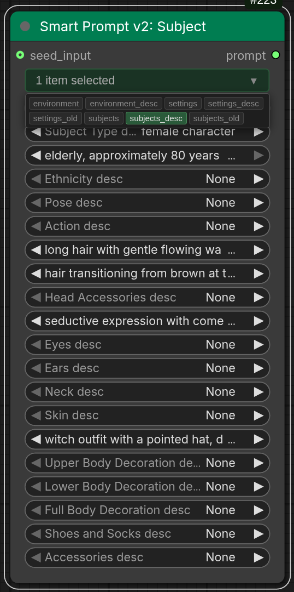

# Smart Prompt User Guide

This guide explains how to use the Smart Prompt v2 node — an intuitive prompt building system that transforms text file collections into organized dropdown menus for rapid prompt composition.

> **Note:** Smart Prompt v1 is still available but Smart Prompt v2 adds multi-folder selection via combo-chips and a `seed_input` connection. New workflows should use v2.

<table><tr>
<td valign="top">

## Table of Contents
- [Overview](#overview)
- [Smart Prompt v2 — Multi-Folder Selection](#smart-prompt-v2--multi-folder-selection)
- [What Smart Prompt Does](#what-smart-prompt-does)
- [Getting Started](#getting-started)
- [Using Smart Prompt](#using-smart-prompt)
- [Creating Custom Prompt Files](#creating-custom-prompt-files)
- [Folder Organization](#folder-organization)
- [Selection Modes](#selection-modes)
- [Seed Control](#seed-control)
- [Tips & Best Practices](#tips--best-practices)
- [Troubleshooting](#troubleshooting)

</td>
<td>

</td>
</tr></table>

---

## Overview

**Smart Prompt** is a prompt building tool that automatically converts text files into dropdown selection menus. Instead of typing prompts manually, you select from curated options organized in categories.

### Key Features

- **File-Based Dropdown System** - Each text file becomes a dropdown menu
- **Category Organization** - Files grouped by folder (subjects, settings, environments, etc.)
- **Three Selection Modes** - None, Random, or Specific selection
- **Seed Control** - Reproducible random selections
- **Folder Filtering** - Show all options or filter by category
- **Auto Assembly** - Selected options automatically joined into prompts

### When to Use Smart Prompt

Use Smart Prompt when you want to:
- Build prompts quickly from curated options
- Experiment with different prompt combinations
- Maintain consistent prompt structures
- Create reusable prompt templates
- Learn effective prompting techniques
- Collaborate with standardized prompt libraries

---

## Smart Prompt v2 — Multi-Folder Selection

Smart Prompt v2 replaces the single-folder dropdown with a **combo-chip widget** for multi-folder selection. Toggle multiple folder chips to show dropdown widgets from several categories simultaneously.

### What Changed from v1

| Feature | v1 | v2 |
|---------|----|----|
| Folder selection | Single dropdown (one folder or "All") | Combo-chip toggles (any combination) |
| Visible widgets | Filtered by single folder | Filtered by all selected folder chips |
| Seed input | Widget + optional `seed_input` connection | Widget + optional `seed_input` connection |
| Default folders | "subjects" | All folders enabled |

### How Multi-Folder Works

1. Each prompt folder appears as a **chip** in the chip bar
2. **Toggle chips on/off** to show/hide that folder's dropdown widgets
3. Multiple folders can be active simultaneously
4. Only widgets from enabled folders are visible — the node stays compact

### seed_input Connection

Both v1 and v2 have an optional `seed_input` input (force_input, not visible as a widget). When connected, it overrides the seed widget value. Use this to sync seeds from other nodes (e.g., sampler settings or folder nodes).

---

## What Smart Prompt Does

### The Concept

Smart Prompt scans text files in the `prompt/` directory and creates a dropdown widget for each file. Each line in a text file becomes a selectable option.

**Example:**

If you have a file `prompt/subjects/1_character.txt` containing:
```
beautiful woman
handsome man
cute child
elderly person
```

Smart Prompt creates a dropdown labeled "subjects character" with these options:
- None
- Random
- beautiful woman
- handsome man
- cute child
- elderly person

Select "beautiful woman" and it appears in your final prompt. Select "Random" and the seed determines which option is chosen.

### File Location

**Primary Location:** `ComfyUI_Eclipse/prompts/`  
**Wildcard Integration:** `models/wildcards/smart_prompt/` (junction → repo prompts/)  
**Junction Access:** `models/Eclipse/prompts/` (junction → repo prompts/)

Smart Prompt reads prompt files directly from the repository's `prompts/` folder:

1. **Repo Files:** Prompt files live in `ComfyUI_Eclipse/prompts/`. Default files are extracted from `.defaults/prompts/` on first run (existing files are never overwritten).

2. **Wildcard Junction:** A junction (Windows) or symlink (Linux/macOS) at `models/wildcards/smart_prompt/` points to the repo's `prompts/` folder for seamless wildcard processor access.

3. **Model Junction:** A junction at `models/Eclipse/prompts/` also points to the repo's `prompts/` folder for convenience.

**Benefits:**
- **Wildcard Integration:** Files accessible via `__smart_prompt/subjects/character__` syntax
- **Safe Customization:** Edit files directly — `.defaults/` extraction never overwrites existing files
- **Git-Safe:** Your custom files not tracked by git (only `.example` files in `.defaults/` are tracked)
- **Easy Reset:** Delete files in `prompts/` and restart to re-extract defaults
- **Updates Preserved:** Git updates only modify `.defaults/`, not your customized files

---

## Getting Started

### Step 1: Understand the File Structure

Navigate to `ComfyUI_Eclipse/prompts/` (also accessible via `models/Eclipse/prompts/` junction).

You'll find folders like:
```
smartprompt/  (or prompt/ in extension directory)
├── subjects/
│   ├── 1_character.txt
│   ├── 2_pose.txt
│   └── 3_expression.txt
├── settings/
│   ├── 1_quality.txt
│   ├── 2_style.txt
│   └── 3_lighting.txt
└── environments/
    ├── 1_location.txt
    └── 2_weather.txt
```

Each folder represents a **category** (subjects, settings, environments).
Each numbered text file becomes a **dropdown widget**.

### Step 2: Add the Node

1. Right-click in ComfyUI workflow
2. Navigate to: `Eclipse > Text > Smart Prompt`
3. The node appears with:
   - **folder** dropdown (All, subjects, settings, environments, etc.)
   - Multiple dropdown widgets (one per text file)
   - **seed** number input

### Step 3: Basic Usage

1. **Select Folder:**
   - "All" shows all dropdown widgets from all folders
   - Select specific folder to show only that category

2. **Make Selections:**
   - Each dropdown has: None, Random, and specific options
   - Choose "None" to skip that option
   - Choose "Random" to let seed pick randomly
   - Choose specific text for that option

3. **Set Seed:**
   - Use any number for consistent results
   - Use -1 for "Randomize Each Time"
   - Click "🎲 New Fixed Random" for a new random seed

4. **Connect Output:**
   - Connect the `prompt` output to CLIP Text Encode nodes
   - The assembled prompt is ready for generation

---

## Using Smart Prompt

### Node Inputs

#### folder (Required)
- **What it is:** Filter which dropdowns are visible
- **Options:**
  - `All` - Show all prompt options from all folders
  - Specific folder name - Show only that category
- **Default:** "subjects"
- **Use case:** Focus on one category or see everything

#### Prompt Selection Dropdowns (Required)
- **What they are:** One dropdown per text file found
- **Label format:** "{folder_name} {file_name}"
- **Options:**
  - `None` - Skip this option (doesn't appear in prompt)
  - `Random` - Seed-controlled random selection from file
  - Specific lines from the text file

#### seed (Required)
- **What it is:** Controls random selections and reproducibility
- **Range:** Any integer, or special values
- **Special values:**
  - `-1` - Randomize each time (generates new seed on each queue)
  - `0` or positive - Fixed seed (same output every time)
- **Default:** 0

#### seed_input (Optional)
- **What it is:** External seed connection from another node
- **When connected:** Overrides the seed widget
- **When disconnected:** Uses seed widget value
- **Use case:** Sync seeds across multiple nodes

### Node Outputs

#### prompt (STRING)
- **What it is:** Assembled prompt from selected options
- **Format:** Comma-separated text
- **Cleaning:** Removes extra spaces, trailing punctuation
- **Example:** "beautiful woman, dramatic lighting, golden hour, forest path"

### Selection Modes Explained

#### None
- Skip this option entirely
- Doesn't add anything to the prompt
- Use when option not needed

**Example:**
```
Character: beautiful woman
Pose: None
Expression: smiling
Result: "beautiful woman, smiling"
```

#### Random
- Node picks one line randomly from the file
- Seed determines which line is chosen
- Same seed = same selection

**Example File (emotions.txt):**
```
happy
sad
excited
calm
mysterious
```

**Usage:**
- Selection: "Random"
- Seed: 12345
- Result: Always picks same emotion with seed 12345
- Change seed to get different emotion

#### Specific Selection
- Choose exact line from file
- Always uses that exact text
- Seed doesn't affect this

**Example:**
```
Character: beautiful woman  (specific selection)
Lighting: Random  (seed-controlled)
Location: Random  (seed-controlled)
```

---

## Creating Custom Prompt Files

### File Naming Convention

Files must follow this pattern:
```
{number}_{name}.txt
```

**Examples:**
- `1_character.txt`
- `2_pose.txt`
- `10_detailed_description.txt`

**Important:**
- **Number comes first** - Controls display order (1, 2, 3, etc.)
- **Underscore separator** - Separates number from name
- **`.txt` extension** - Must be text file
- **Name becomes label** - Appears in dropdown (underscores become spaces)

### File Content Format

**One option per line:**
```
first option
second option
third option
```

**Best Practices:**
- Each line is a complete, coherent prompt element
- No empty lines (or they'll appear as options)
- No special formatting needed
- Can include commas within lines if needed

**Example File (`1_quality.txt`):**
```
masterpiece, best quality
high quality, detailed
photorealistic
artistic, stylized
sketch, draft style
```

### Step-by-Step File Creation

1. **Navigate to Prompt Directory:**
   ```
   ComfyUI/models/wildcards/smartprompt/
   ```
   (Or delete files in `ComfyUI_Eclipse/prompts/` and restart to re-extract defaults from `.defaults/`)

2. **Choose or Create Folder:**
   - Use existing: `subjects/`, `settings/`, `environments/`
   - Or create new: `styles/`, `colors/`, `moods/`, etc.

3. **Create Text File:**
   - Name it: `1_my_options.txt` (start with number)
   - Open in text editor

4. **Add Options:**
   ```
   option one
   option two
   option three
   option four
   ```

5. **Save File**

6. **Reload ComfyUI** (or just refresh workflow)

7. **Check Node:**
   - New dropdown appears automatically
   - Label shows: "{folder} my options"
   - Options include: None, Random, option one, option two, etc.

### Example: Creating a Lighting Styles File

**Filename:** `smartprompt/settings/5_lighting_styles.txt`

**Content:**
```
dramatic lighting, high contrast
soft natural light, diffused
golden hour glow, warm tones
studio lighting, professional
moody shadows, low key
bright and airy, high key
cinematic lighting, volumetric
```

**Result in Node:**
- Dropdown labeled: "settings lighting styles"
- Options: None, Random, dramatic lighting..., soft natural light..., etc.

---

## Folder Organization

### Default Folder Structure

```
smartprompt/  (in ComfyUI/models/wildcards/)
├── subjects/
│   ├── 1_character.txt      (people descriptions)
│   ├── 2_pose.txt           (body positions)
│   └── 3_expression.txt     (facial expressions)
├── settings/
│   ├── 1_quality.txt        (quality tags)
│   ├── 2_style.txt          (art styles)
│   └── 3_lighting.txt       (lighting setups)
└── environments/
    ├── 1_location.txt       (places)
    └── 2_weather.txt        (weather conditions)
```

### Folder Filtering

The **folder** dropdown filters which widgets are visible:

**"All" selected:**
- Shows every dropdown from every folder
- Useful when building complex prompts
- Can see all available options

**Specific folder selected (e.g., "subjects"):**
- Shows only dropdowns from that folder
- Cleaner interface, focused selection
- Faster workflow for specific tasks

#### Creating Custom Folders

1. **Navigate to:** `ComfyUI_Eclipse/prompts/` (also accessible via `models/Eclipse/prompts/` junction)

2. **Create New Folder:**
   - Name it descriptively: `colors/`, `textures/`, `cameras/`, etc.
   - Optional: Prefix with number for ordering: `1_subjects/`, `2_styles/`

3. **Add Text Files:**
   - Follow naming convention: `1_name.txt`
   - Add one option per line

4. **Reload ComfyUI:**
   - New folder appears in folder dropdown
   - Files appear as widgets when folder selected

**Example Custom Folder:**

Create `smartprompt/cameras/1_camera_angles.txt`:
```
eye level, straight on
low angle, looking up
high angle, looking down
bird's eye view, top down
Dutch angle, tilted
over the shoulder
close-up
wide shot
```

Result: "cameras camera angles" dropdown with these options

---

## Selection Modes

### Building Prompts with Mixed Modes

You can combine all three selection modes in a single prompt:

**Example Setup:**
```
Character: beautiful woman        (Specific)
Pose: Random                       (Random, seed-controlled)
Expression: None                   (Skip)
Quality: masterpiece, best quality (Specific)
Lighting: Random                   (Random, seed-controlled)
Location: forest path              (Specific)
```

**Seed: 42**

**Result:** "beautiful woman, sitting cross-legged, masterpiece, best quality, golden hour glow, forest path"

Change seed to 43, get different pose and lighting but same character, quality, and location.

### Workflow Examples

#### Consistent Character, Variable Scene

```
Character: beautiful woman, long hair (Specific)
Pose: Random
Expression: Random
Settings: Random
Location: Random
Seed: [Different each generation]
```

**Use case:** Generate multiple images of same character in different situations

#### Template with One Variable

```
Character: Random
Pose: standing confidently (Specific)
Quality: masterpiece, best quality (Specific)
Style: photorealistic (Specific)
Seed: [Fixed for reproducibility]
```

**Use case:** A/B testing different characters with same setup

#### Complete Randomization

```
All dropdowns: Random
Seed: -1 (Randomize Each Time)
```

**Use case:** Creative exploration, unexpected combinations

---

## Seed Control

### Understanding Seeds

**Seed** is a number that controls random selection. Same seed = same random choices.

### Seed Widget

The main seed input field where you enter numbers.

**Values:**
- `0` or any positive number - Fixed seed (reproducible)
- `-1` - Special: Randomize each time

### Seed Buttons

#### 🎲 Randomize Each Time
- Sets seed to `-1`
- Each queue generates a new random seed
- Different output every time
- Non-reproducible (can't recreate exact result)

**Use case:** Creative exploration, generating variety

#### 🎲 New Fixed Random
- Generates new random number
- Sets that as the seed value
- Fixed seed means reproducible
- Click again for different fixed seed

**Use case:** Found good result, want to iterate on it

#### ♻️ (Use Last Queued Seed)
- Appears after first queue
- Copies seed from last successful generation
- Useful for recreating previous output
- Becomes enabled after first execution

**Use case:** "That was perfect, use that seed again"

### Seed Input Connection

**Optional `seed_input` connection:**
- Connect from other seed nodes
- Overrides seed widget when connected
- Seed buttons hidden when connected
- Useful for syncing seeds across nodes

**Example:**
```
Seed Node → seed_input (Smart Prompt)
           → seed_input (Another Node)
```

Both nodes use same seed, ensuring consistency.

### Seed Workflow Examples

#### Fixed Seed for Consistency

**Setup:**
```
Seed: 12345 (specific number)
Character: Random
Lighting: Random
Location: Random
```

**Result:** Same character, lighting, and location every time. Perfect for iteration.

#### Randomize for Exploration

**Setup:**
```
Seed: -1 (Randomize Each Time)
All selections: Random
```

**Result:** Completely different prompt each generation. Great for discovery.

#### Controlled Variation

**Setup:**
```
Seed: 100 (start)
Character: specific
Others: Random
```

**Process:**
1. Generate with seed 100
2. Like it? Keep seed
3. Want variation? Change to 101, 102, etc.
4. Small seed changes = small variations

---

## Tips & Best Practices

### File Organization

**Keep Files Focused:**
- One concept per file
- Related options together
- Clear, descriptive filenames

**Good Example:**
```
1_character_gender.txt  → male, female, person
2_character_age.txt     → young, middle-aged, elderly
3_character_build.txt   → slim, athletic, heavyset
```

**Bad Example:**
```
1_character.txt  → male young slim, female elderly heavyset, person middle-aged athletic
```

### Numbering Strategy

**Use Numbers for Order:**
- Most important first (1, 2, 3...)
- Logical flow (character → pose → setting → lighting)
- Leave gaps (1, 5, 10) for future additions

**Example Numbering:**
```
1_character.txt     (most important)
5_pose.txt          (next important)
10_expression.txt   (detail)
15_clothing.txt     (additional detail)
```

**Why gaps?** You can add `3_age.txt` later without renumbering everything.

### Writing Good Options

**Clear and Specific:**
✅ "dramatic lighting, high contrast shadows"
❌ "nice lighting"

**Complete Phrases:**
✅ "beautiful woman with long flowing hair"
❌ "beautiful" (incomplete thought)

**Consistent Style:**
- All options in same format
- Same level of detail
- Similar structure

**Example File:**
```
photorealistic portrait, highly detailed, 8k
artistic oil painting, brush strokes visible
digital art, smooth, clean lines
watercolor illustration, soft colors
charcoal sketch, high contrast
```

### Prompt Assembly Strategy

**Layer Your Selections:**

1. **Foundation** (character, subject)
2. **Details** (pose, expression, clothing)
3. **Quality** (tags like "masterpiece, best quality")
4. **Style** (art style, technique)
5. **Environment** (location, setting)
6. **Atmosphere** (lighting, mood, weather)

**Why?** Creates natural, coherent prompts that AI understands well.

### Seed Management

**When to Use Fixed Seeds:**
- Iterating on a good result
- A/B testing specific changes
- Documentation/tutorials
- Client approval workflows

**When to Use Random (-1):**
- Initial exploration
- Generating variety
- Building reference sets
- Creative discovery

**Pro Tip:** Start with random (-1) to explore. When you find something good, switch to that specific seed for refinement.

### Folder Filtering

**Use "All" When:**
- Building complete prompts
- Need options from multiple categories
- Working on complex scenes

**Use Specific Folder When:**
- Focused on one aspect (just changing lighting)
- Cleaner interface needed
- Teaching/demonstrating specific category

### Performance Tips

**File Size:**
- Keep files manageable (20-50 options)
- Split large lists into multiple files
- Use clear categories

**Naming:**
- Use descriptive names
- Avoid special characters
- Keep names short but clear

**Updates:**
- Changes to text files may require ComfyUI reload
- Test new files before production
- Keep backups of working configurations

---

## Troubleshooting

### No Dropdowns Appear

**Problem:** Node loads but shows no prompt selection dropdowns.

**Solutions:**

1. **Check folder exists:**
   - Primary: `ComfyUI_Eclipse/prompts/`
   - Junction: `models/Eclipse/prompts/` (junction → repo prompts/)
   - Wildcard junction: `models/wildcards/smart_prompt/` (junction → repo prompts/)

2. **Check folder structure:**
   ```
   smartprompt/
   ├── subjects/        (folder)
   │   └── 1_file.txt   (numbered file)
   ```

3. **Verify file naming:**
   - Must start with number: `1_`, `2_`, etc.
   - Must have `.txt` extension
   - Number and name separated by `_`

4. **Try resetting:**
   - Delete files in `ComfyUI_Eclipse/prompts/` folder
   - Restart ComfyUI (will re-extract defaults from `.defaults/`)

5. **Restart ComfyUI:**
   - Changes to files/folders need reload
   - Refresh browser if needed

### Dropdown Shows But Empty

**Problem:** Dropdown exists but shows only "None" and "Random", no actual options.

**Check:**

1. **File has content:**
   - Open text file
   - Verify lines aren't empty
   - Save file after adding content

2. **File encoding:**
   - Use UTF-8 encoding
   - Avoid special characters if encoding issues

3. **Line breaks:**
   - Each option on new line
   - No blank lines in file
   - File ends with newline

### Prompt Not Assembling

**Problem:** Make selections but output prompt is empty or wrong.

**Check:**

1. **Selections made:**
   - At least one dropdown not set to "None"
   - Options selected are visible

2. **Folder filter:**
   - "All" shows all options
   - Specific folder may hide some selections

3. **Seed value:**
   - For "Random" selections, seed affects output
   - Try different seed

4. **Connect output:**
   - Verify `prompt` output is connected
   - Check downstream node receives text

### Random Selections Not Working

**Problem:** Selected "Random" but same option always chosen.

**Cause:** Seed is fixed, which is correct behavior! Same seed = same random selection.

**Solutions:**

1. **Want different each time?**
   - Set seed to `-1` (Randomize Each Time)
   - Or click "🎲 Randomize Each Time" button

2. **Want reproducible variation?**
   - Change seed value (0 → 1 → 2 ...)
   - Each seed gives different random selection
   - Same seed always gives same selection

### Seed Buttons Not Appearing

**Problem:** Seed widget exists but no buttons visible.

**Check:**

1. **seed_input connected?**
   - When `seed_input` is connected, buttons hide
   - This is intentional (external seed controls)
   - Disconnect seed_input to see buttons

2. **Node initialization:**
   - Delete and re-add node
   - Restart ComfyUI

### Files Not Loading After Update

**Problem:** Added new files but don't appear in node.

**Solutions:**

1. **Restart ComfyUI:**
   - Full server restart
   - Clear browser cache (Ctrl+F5)

2. **Check file location:**
   - Primary: Files in `ComfyUI_Eclipse/prompts/`
   - Junction: `models/Eclipse/prompts/` (junction → repo prompts/)
   - Files in correct subfolder?

3. **Verify filename:**
   - Starts with number?
   - Has `.txt` extension?
   - Saved file (not just created)?

4. **Delete and re-add node:**
   - Remove node from workflow
   - Add new Smart Prompt node
   - New files should appear

### Unexpected Prompt Output

**Problem:** Prompt contains weird text or formatting issues.

**Check:**

1. **Text file content:**
   - Open files directly
   - Look for typos, extra punctuation
   - Check for invisible characters

2. **Selection combination:**
   - Some combinations may not make sense
   - Adjust file contents or selections

3. **Trailing punctuation:**
   - Node auto-removes trailing commas/periods
   - If issues persist, clean up text files

### Folder Filter Not Working

**Problem:** Selecting folder doesn't hide/show expected widgets.

**Check:**

1. **Folder names match:**
   - Dropdown shows clean names (without numbers)
   - Folder on disk might be `1_subjects/`
   - Dropdown shows just `subjects`

2. **Reload node:**
   - Delete and re-add node
   - Restart ComfyUI

3. **File organization:**
   - Files in correct folder?
   - Folders properly nested under `prompt/`?

---

## Advanced Topics

### Multi-Language Support

**Creating Bilingual Files:**

`1_character_en.txt`:
```
beautiful woman
handsome man
```

`1_character_jp.txt`:
```
美しい女性
ハンサムな男性
```

Use folder filtering to switch between languages.

### Hierarchical Prompts

**Organize by Detail Level:**

```
prompt/
├── base/
│   ├── 1_subject.txt        (core subject)
│   └── 2_quality.txt        (quality tags)
├── details/
│   ├── 1_pose.txt           (specific details)
│   └── 2_expression.txt
└── advanced/
    ├── 1_camera.txt         (technical details)
    └── 2_lighting.txt
```

Filter by folder to control complexity.

### Template Workflows

**Save Workflow Presets:**

Create workflow with Smart Prompt configured:
- Specific folder selected
- Certain dropdowns pre-set
- Seed configured

Save workflow for quick loading.

### Integration with Other Nodes

**Combine with Wildcard Processor:**
```
Smart Prompt → prompt (base structure)
Wildcard Processor → adds variations (e.g., __smart_prompt/subjects/character__)
Merge Strings → combine both
```

**Use with Multiple Encoders:**
```
Smart Prompt 1 → Positive CLIP
Smart Prompt 2 → Negative CLIP
```

Different prompt libraries for positive/negative prompts.

**Note:** Smart Prompt files in `ComfyUI/models/wildcards/smart_prompt/` (junction to Eclipse/smart_prompt/) can be accessed by Wildcard Processor using the syntax: `__smart_prompt/folder/filename__`

---

## Quick Reference

### File Naming
- Format: `{number}_{name}.txt`
- Example: `1_character.txt`, `5_lighting.txt`
- Number controls order
- Name becomes label (underscores → spaces)

### File Location
- Primary: `ComfyUI_Eclipse/prompts/` (defaults extracted from `.defaults/` on first run)
- Junction: `models/Eclipse/prompts/` (junction → repo prompts/)
- Wildcard: `models/wildcards/smart_prompt/` (junction → repo prompts/)
- Wildcard syntax: `__smart_prompt/folder/filename__`

### Selection Modes
| Mode | Behavior |
|------|----------|
| None | Skip this option |
| Random | Seed-controlled random pick |
| Specific | Use exact text |

### Seed Values
| Value | Behavior |
|-------|----------|
| 0+ | Fixed seed (reproducible) |
| -1 | Randomize each time |

### Node Inputs
- **folder** - Filter visible dropdowns
- **{prompts}** - Dynamic dropdowns from files
- **seed** - Random selection control
- **seed_input** - Optional external seed

### Node Outputs
- **prompt** (STRING) - Assembled comma-separated text

---

## Related Documentation

- [Replace String v3](Replace_String_v3.md) - Clean LLM output before prompts
- [Wildcard Processor Guide](Wildcard_Processor.md) - Template-based prompt expansion
- [Smart Model Loader](Smart_Loaders.md) - Unified model loading
- [Save Images v2](Save_Images.md) - Advanced image saving with metadata

---

**Need help?** Check the main [README](../README.md) or open an issue on the [GitHub repository](https://github.com/r-vage/ComfyUI_Eclipse).
